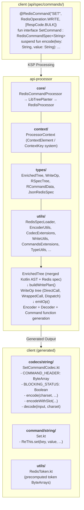

# API Processor

A Kotlin Symbol Processing (KSP) based code generator for the re.this Redis client library. This processor automatically generates type-safe codec classes and extension functions for Redis commands based on declarative command specifications.

## Overview

The API Processor transforms annotated interface specifications (in the `client` module under `api/spec/commands/`) into:

1. **Codec Objects** – Handle encoding commands to RESP protocol and decoding responses  
2. **Extension Functions** – Provide ergonomic APIs on the `ReThis` client for each command

This eliminates boilerplate code and ensures consistency between command specifications and their implementations.

---

## Architecture



---

## Processing Pipeline

### 1. Symbol Discovery

The processor scans for all interfaces annotated with `@RedisCommand`:

```kotlin
@RedisCommand(
    "SET",
    RedisOperation.WRITE,
    [RespCode.BULK, RespCode.SIMPLE_STRING, RespCode.NULL],
)
fun interface SetCommand : RedisCommandSpec<String> {
    suspend fun encode(
        key: String,
        value: String,
        @RIgnoreSpecAbsence vararg options: SetOption,
    ): CommandRequest
}
```

---

### 2. Redis Specification Loading

The processor loads official Redis command specifications from:

* `commands.json` – Core Redis commands
* `commands_redisjson.json` – RedisJSON module commands
* `sentinel_spec.json` – Sentinel commands (bundled locally)
* `resp2_replies.json` / `resp3_replies.json` – Response type mappings

These specs provide:

* Argument structure and ordering
* Optional / required flags
* Token names (`EX`, `PX`, `NX`, …)
* Key indices

---

### 3. Tree Construction (LibTreePlanter)

The processor builds an **Enriched Tree** that merges:

* **Kotlin AST** – Parameter types, annotations, nullability
* **Redis Spec** – Argument names, tokens, optionality, key positions

```text
EnrichedNode (root: encode function)
├── EnrichedNode (param: key)
│   ├── Attr: Name("key")
│   ├── Attr: Type(String)
│   ├── Attr: Key
│   └── Attr: RelatedRSpec
├── EnrichedNode (param: value)
│   ├── Attr: Name("value")
│   └── Attr: Type(String)
└── EnrichedNode (param: options)
    ├── Attr: Multiple(vararg=true)
    ├── Attr: Optional
    └── children:
        └── EnrichedNode (sealed class: SetOption)
            ├── SetExpire.Ex  → Token("EX")
            ├── SetExpire.Px  → Token("PX")
            └── ...
```

---

### 4. Write Plan Generation

The enriched tree is transformed into a sequence of `WriteOp`s:

* **DirectCall** – Simple value writes
* **WrappedCall** – Nullability, varargs, collections
* **Dispatch** – `when` expressions for sealed hierarchies

---

### 5. Code Generation

#### Encoder Generation

```kotlin
public object SetCommandCodec {
    private const val BLOCKING_STATUS: Boolean = false
    private val COMMAND_HEADER: ByteArray = "*5\r\n$3\r\nSET\r\n".encodeToByteArray()

    public fun encode(
        charset: Charset,
        key: String,
        value: String,
        vararg options: SetOption,
    ): CommandRequest {
        var argCount = 1 // base command parts
        // ... size counting for optional/vararg params ...
        val buffer = Buffer()
        buffer.writeArrayHeader(argCount) // only when haveVaryingSize
        buffer.write(COMMAND_HEADER)
        // ... write parameters ...
        return CommandRequest(buffer, RedisOperation.WRITE, BLOCKING_STATUS)
    }

    public fun encodeWithSlot(
        charset: Charset,
        key: String,
        value: String,
        vararg options: SetOption,
    ): CommandRequest {
        var slot: Int? = null
        // ... CRC16 slot calculation for key params ...
        val request = encode(charset, key = key, value = value, options = options)
        return request.withSlot(slot % 16384)
    }
}
```

#### Decoder Generation

```kotlin
public fun decode(input: Buffer, charset: Charset): String? {
    return when (val code = input.parseCode(RespCode.BULK)) {
        RespCode.BULK -> BulkStringDecoder.decodeNullable(input, charset, code)
        RespCode.SIMPLE_STRING -> SimpleStringDecoder.decode(input, charset, code)
        RespCode.NULL -> null
        else -> throw UnexpectedResponseType(
            "Expected [BULK, SIMPLE_STRING, NULL] but got $code",
            input.tryInferCause(code),
        )
    }
}
```

#### Command Function Generation

```kotlin
public suspend fun ReThis.set(
    key: String,
    value: String,
    vararg options: SetOption,
): String? {
    val request = if (cfg.withSlots) {
        SetCommandCodec.encodeWithSlot(charset = cfg.charset, key = key, value = value, options = options)
    } else {
        SetCommandCodec.encode(charset = cfg.charset, key = key, value = value, options = options)
    }
    return SetCommandCodec.decode(topology.handle(request), cfg.charset)
}
```

---

## Configuration

```kotlin
ksp {
    arg(
        "clientProjectDir",
        rootDir.resolve("client/src/commonMain/kotlin").absolutePath
    )
}
```

## Additional Details

### 1. **Naming Convention for BA (ByteArray) Commands**

Commands that work with `ByteArray` instead of `String` follow a naming pattern:
- Spec class: `SetBACommand`, `GetBACommand`
- Generated function: `setBA()`, `getBA()`

The `BA` suffix is automatically handled - the function name is derived from the codec name by removing `CommandCodec` and lowercasing the first letter.

### 2. **Redis Spec Fetching Happens at Compile Time**

`RedisSpecLoader` fetches specs from GitHub **during KSP processing** (not at runtime). This means:
- Build will fail if network is unavailable and specs aren't cached
- The URL is pinned to a specific commit hash for stability
- Sentinel specs are bundled locally in `resources/sentinel_spec.json` because they're not in the official repo

### 3. **The `RSpecNode.path` Matching System**

Redis specs have nested argument structures. The processor uses path-based matching to find the correct spec node:
- Each spec node has a `path` (e.g., `["SET", "condition", "NX"]`)
- Parameters are matched by their "normalized name" against spec paths
- The `isWithinBounds()` function checks if a node's path is within the parent's bounds

### 4. **Slot Calculation for Redis Cluster**

Keys are identified by `keySpecIndex` in the Redis spec. The processor:
- Generates `encodeWithSlot()` that delegates to `encode()` and adds slot information
- Uses `validateSlot()` (CRC16-based) to ensure all keys hash to the same slot
- Attaches the slot via `request.withSlot(slot % 16384)`
- Throws `KeyAbsentException` if a collection key parameter is empty
- If a command has no key parameters (all `keySpecIndex` are null), `encodeWithSlot()` simply delegates to `encode()`

### 5. **The `haveVaryingSize` Flag**

Commands with optional/vararg parameters can't know the argument count at compile time. When `haveVaryingSize` is true:
- The codec uses `var argCount = X` (where X is the base command part count)
- Each optional argument increments `argCount += 1`
- The RESP array header is written via `buffer.writeArrayHeader(argCount)` **before** the static command header bytes

### 6. **Context is Static (Singleton)**

```kotlin
internal companion object {
    val context = ProcessorContext()
}
```

The `ProcessorContext` is a **static singleton** backed by a `ConcurrentHashMap` using a type-safe `ContextElement`/`ContextKey` system. Each context element declares its own key, and keys specify whether they are per-command (cleared between commands via `clearPerCommand()`) or global (cleared only via `clearAll()` between builds).

**Global elements**: `RSpecRaw`, `ProcessorMeta`, `Logger`, `ResolvedSpecs`, `SpecResponses`, `ValidationResult`, `CommandFileSpec`, `CollectedTokens`

**Per-command elements** (cleared between each command spec): `CurrentCommand`, `Imports`, `ETree`, `CodecFileSpec`, `CodecObjectTypeSpec`, `CodeGenContext`

Elements can also implement `onFinish()` for end-of-processing actions (e.g., `CollectedTokens` generates `RedisToken.kt`, `CommandFileSpec` writes command files).

### 7. **`@RIgnoreSpecAbsence` Annotation**

When you add a parameter that doesn't exist in the official Redis spec (like custom options), use this annotation to suppress the "Param not found in RSpec" warning.

### 8. **Custom Codec Support**

For commands with complex response parsing, you can bypass auto-generation:
```kotlin
@RedisMeta.CustomCodec(
    decoder = MyDecoder::class,  // KClass<out ResponseDecoder<*>>
    encoder = MyEncoder::class,  // KClass<*>
)
```

Both parameters have defaults (`ResponseDecoder::class` and `Unit::class`), so you can override just the decoder or just the encoder. Check for this with `hasCustomEncoder` / `hasCustomDecoder` properties on `CurrentCommand`.

### 9. **Token vs Name vs DisplayText**

In Redis specs:
- `token` - The literal string sent in the command (e.g., "EX", "NX")
- `name` - Internal identifier used for matching
- `displayText` - Human-readable name (not used by processor)

The processor matches Kotlin parameter names against `name` (normalized to camelCase).

### 10. **Data Objects Generate Tokens Automatically**

Kotlin `data object` declarations automatically emit their name as a token:
```kotlin
data object GET : SetOption  // Emits "GET" token
```


The token name can be overridden with `@RedisOption.Token("CUSTOM")`.

### 11. **TimeUnit Handling**

Duration/Instant parameters need time unit conversion. The spec's expected unit is inferred from the token name:
- `EX` → seconds
- `PX` → milliseconds
- `EXAT`/`PXAT` → Unix timestamps

Use `@RedisMeta.OutgoingTimeUnit` to override.

### 12. **Decoder Selection Logic**

Response decoding uses this priority:
1. Check for `@RedisMeta.CustomCodec` → delegate to custom decoder
2. Generate a `when` block dispatching on the runtime `RespCode`:
   - If both `MAP` and `ARRAY` are in `responseTypes`, ARRAY branch uses the map decoder (implicit map response)
   - Simple codes (`SIMPLE_STRING`, `BULK`, `INTEGER`, etc.) → match via `plainDecoders` map, with special handling for `Boolean` (e.g., `== "OK"` or `== 1L`), `Double` (`.toDouble()`), and `ByteArray` (`BulkByteArrayDecoder` for BULK) return types
   - `ARRAY` / `SET` codes → match via `collectionDecoders` map
   - `MAP` codes → match via `mapDecoders` map
   - `NULL` → returns `null`
   - `else` → throws `UnexpectedResponseType` with cause inference

### 13. **The `WriteOp` Hierarchy**

Understanding how code emission works:
- `DirectCall` - Leaf operation, writes a single value (has separate `encodeBlock` and `slotBlock` lambdas)
- `WrappedCall` - Adds guards (`?.let`, `forEach`, `if (isNotEmpty())`)
- `Dispatch` - Generates `when(x) { is Type -> ... }` for sealed classes

Props controlling wrapping behavior:
- `NULLABLE` → wraps in `?.let { ... }`
- `COLLECTION` → wraps in `.forEach { ... }`
- `SINGLE_TOKEN` → emits non-multiple tokens before inner ops
- `MULTIPLE_TOKEN` → emits multiple-flagged tokens
- `WITH_SIZE` → emits the collection `.size` as a RESP bulk string

Each `WriteOp` is emitted in three phases: `SIZE` (count arguments), `WRITE` (emit bytes), and `SLOT` (extract key slots).

### 14. **RedisToken.kt Generation**

The processor collects all token strings encountered via `@RedisOption.Token` annotations during processing. At the end of the build (`onFinish`), it generates a `RedisToken.kt` object under `eu.vendeli.rethis.utils` containing precomputed `ByteArray` constants:

```kotlin
internal object RedisToken {
    val EX = "EX".encodeToByteArray()
    val PX = "PX".encodeToByteArray()
    // ...
}
```

Generated codecs reference these constants (e.g., `buffer.writeBulkString(RedisToken.EX)`) to avoid repeated string-to-byte conversions at runtime.

### 15. **Spec Validation**

The processor validates each command against the official Redis spec:
- **Operation validation**: Checks that declared `RedisOperation` (READ/WRITE) matches the spec's `commandFlags`. Skipped for JSON and Sentinel commands.
- **Blocking validation**: Checks that `isBlocking` matches the spec's `blocking` flag. Skipped for Sentinel commands.

Mismatches are reported as errors via `ValidationResult`.

### 16. **Additional Annotations**

- `@RedisMeta.SkipCommand` – Applied to a spec class to skip generating the command extension function (only the codec is generated).
- `@RedisMeta.Default(value)` – Sets a default value for a parameter in the generated command function.
- `@RedisMeta.Weight(value)` – Overrides the argument count contribution of a parameter (default is 1). Used when a single parameter encodes to multiple RESP elements.
- `@RedisMeta.WithSizeParam(name)` – Marks a parameter as having an associated size parameter that should be emitted in the encoder.

### 17. **KSP Incremental Processing Caveats**

Despite `ksp.incremental=false` in gradle.properties, you may still encounter issues. Always run `clean` when:
- Adding new command specs
- Modifying shared types used by multiple specs
- Changing the processor itself